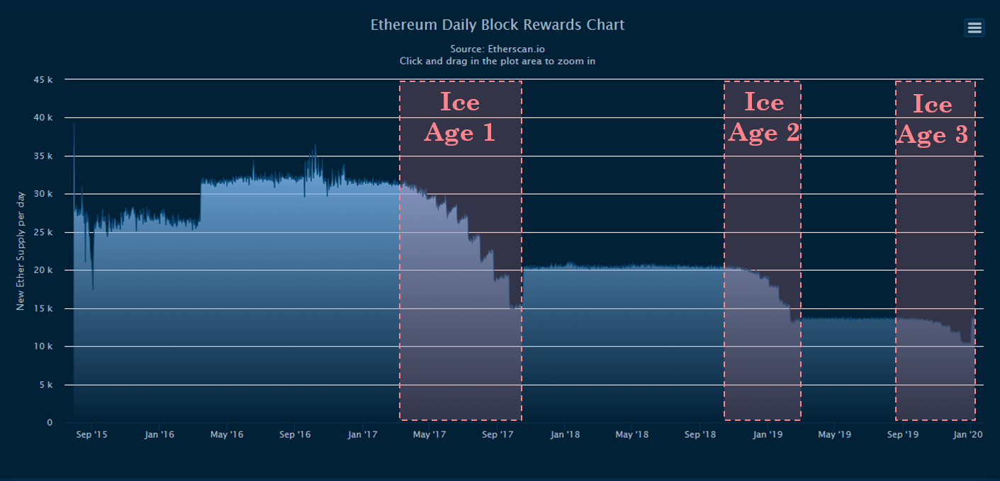
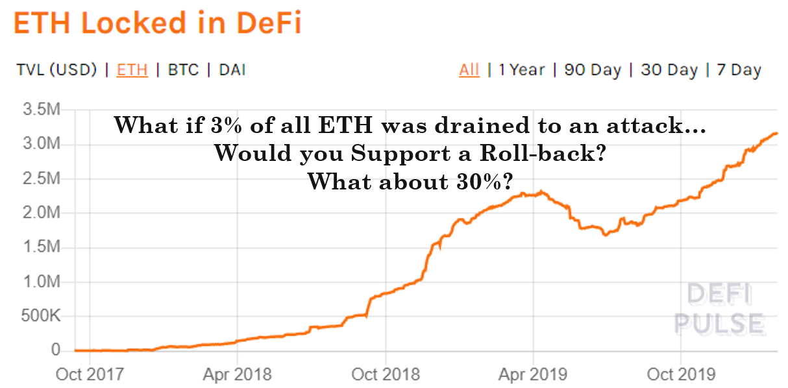

# Why Ethereum Will Not Sustain a Long Term Monetary Premium

The Ethereum project has long drawn critiques, especially from Bitcoiners, regarding many facets of its design, execution and failure to deliver what was originally stipulated in the ICO offering. The project is currently attempting the immense engineering challenge of reconstructing an entirely new blockchain, followed by integration of the existing chain whilst both are in live operation.

This is no easy feat and highlights irrefutable issues with the original design and continued uncertainties for investors into the future.

At the same time, the project has found a new direction focusing on distributed financial applications. This is supported by, what is positioned as, a ‘moat’ of developer activity. The underlying ethos behind this movement is ‘open and unstoppable finance’, and establishing ETH as the reserve monetary asset of the ecosystem. 

In this article, I will outline a position as to why, despite this movement, the ETH token is unlikely to develop a convincing monetary premium. This is even more relevant whilst ETH is in competition against fixed supply, deterministically issued cryptocurrencies with deep liquidity like Bitcoin. The core arguments will centre around the following topics:

- Uncertainty in monetary policy and (perception of) centralised governance.
- Second system syndrome and persistent project misdirection.
- Reliance on the application layer for value accrual.
- Underestimation of the ‘tortoise and the hare’ reality of Bitcoin development.

## MONETARY POLICY AND GOVERNANCE
The core design of Bitcoin’s monetary policy was hard-coded at genesis with a pre-determined supply curve and 21M coin supply. The Monetary policy has only changed once via a soft-fork in BIP-42 to remove Satoshi’s anomalous undefined behaviour in C++ and enable alternate clients to be developed.

This monetary policy is now protected by a firm social contract. It is unlikely Bitcoin’s monetary policy will ever change without destroying the project’s fundamental values and splintering the chain. Should this supply curve ever be tampered with, most Bitcoiners agree, that the result would no longer be Bitcoin.

This provides relative certainty for investors and has attracted an impressive capture of value over Bitcoin’s 11 year history. Bitcoin's design instils confidence regarding expectations of future inflation and supply.

For Ethereum, the 2014 ICO launch was undertaken with the knowledge of a Proof-of-Stake transition at some stage into the future. As motivation for developer progress towards this goal, the ‘Ice Age’ was baked into the protocol which deliberately increases block times by winding up PoW difficulty. This acts to disincentivise miners from carrying on with the PoW chain facilitating an easier switch to PoS.

The Ice Age has recently been delayed for the third time in Ethereum’s history by a hard fork change to the consensus rules. In all cases, a PoS implementation was not ready for deployment and the first two hard forks delays were bundled with a reduction to the ETH issuance rate.

**Unsound Monetary Policy**

Ethereum bulls often point to the continual reduction in block rewards as an indication of monetary hardness and increasing scarcity. However the distinction must be made between issuance rate of an asset (hardness) and the asset’s soundness or resistance to human tampering. 

Whilst the issuance rate has been reduced to date, the selection of the inflation rate is the product of developer intervention rather than deterministic and reliable hard coded changes.

The point of critique here is simply that a small pool of people have authority to determine the inflation rate of what is supposed to be a global monetary asset. Play this game out long enough, and eventually, someone at the helm will abuse this power.

It is unknown what the inflation rate and coin supply will be in the future. Even with Ethereum 2.0, who has authority to determine what success looks like under minimum viable issuance? Somebody will hold the authority to tune the dials on staking rates until this subjective and dynamic goal is reached. If it is left to the algorithm and found to be vulnerable to attack, someone will enter the protocol to change inflation.

This process will never stop since attack vectors never cease evolving. Thus Ethereum can only be considered to have an unsound monetary policy with a social contract that bestows monetary authority to a small collective.

**Centralisation of Nodes and Validators**

Bitcoin has previously undergone contentious periods with the most prominent one during the scaling wars over SegWit activation. The User Activated Soft Fork (UASF) movement nullified miner capture of the chain by social consensus. User nodes were upgraded to invalidate miner rewards who did not comply.

To empower this, Bitcoin node software has always been designed as lightweight to ensure trivial hardware requirements and ease of access by the public.

Ethereum has historically required more specialised, high performance hardware for the operation of nodes. This is generally a result of a larger scope of transactions and heavier demand on block-space from Turing Completeness. 

Whilst optimisations of node hardware will continue, sync times and hardware demand are only increasing. Should Ethereum reach a truly global audience, this threatens centralisation of nodes to large scale actors who can replace SDD drives frequently. It is possible that node operators will centralise around Ethereum core devs (e.g. EF and Consensys), exchange merchants, crypto banks and a collection of stake service providers.

Slashing in Ethereum 2.0 actually promotes this behaviour as the average user lacks technical proficiency and thus will opt for the convenience of exchanges and stake providers.

With the above centralisation taking effect in time, the capacity for users to signal intent and initiate a UASF type defence against malicious actors is greatly diminished.

This highlights a progressive centralisation of governance power relationship towards the core developers, who hold considerable ETH to validate PoS and also influence the direction of monetary policy experiments.

**Monetary Experiments**

The latest experiment in monetary policy under discussion is EIP1559, introducing an ETH burn mechanism which completely shifts the blockchain mechanics and incentive systems.

Ultimately, this burning mechanism is of greatest benefit to current ETH holders and is to the detriment of holders and users in the future. Assuming network growth, the burn rate of ETH acts to increase the cost of $ denominated gas for users (fee inflation). Stakers are largely unaffected by this as they benefit from a non-dilutive block reward as well as the taxation by burn.

The author fears that this monetary policy experiment is crafted by those with the most to gain, and is designed in response to 'research forecasts' by the developers finding the current gas-fee mechanism is failing to accrue value. 

**This appears to closely resemble the present day central banking experiment and Cantillon Effect.**

One can only conclude that the monetary policy of Ethereum is relatively fluid and influenced by people rather than code. This uncertainty reflects an un-sound monetary policy (subject to human tampering) and instils a defendable perception of centralised governance. This no doubt a hinderance to Ethereum’s development of a monetary premium and seems likely to only deteriorate in time.

## SECOND SYSTEM SYNDROME

The original premise of the Ethereum project was to expand on Bitcoin’s feature set by introducing Turing complete scripting capabilities. The design intention was to create a network of global computation, a ‘world computer’. This is in fact a valid design goal and one to which Ethereum is well suited, providing a CAPTCHA for a new internet of transactions.

The trade-off from this design decision is an increased protocol complexity, larger attack surface for bugs and hacks, and inevitable blockchain bloat. The design direction of Ethereum has also pivoted several times in response to the market demands. Narratives have shifted from world computer, to unstoppable dAPPS, to token issuance and now to open finance applications. 

It is notable that the original Ethereum design explicitly excluded money as an intended use case for the ETH token. This has since been revised on the Ethereum.org website and project documentation.

Whilst this represents a side of innovation and lessons learned, the design trajectory of the project has shown a continual gravitation towards the Bitcoin design, and sole use as a monetary asset. During this time, Bitcoin has continued to build money like characteristics, like liquidity, network effects, financial products which ultimately drive a strong reputation and product market fit.

Ethereum in, many ways, is the perfect example of **Second System Syndrome**. This is where a simple technology like Bitcoin is deemed incapable of meeting its design goals, iterated upon by a more complex and ‘promising’ project, that is ultimately caught in an endless cycle of research, newly discovered problems and delayed delivery schedules. 

With the rebuild of Ethereum 2.0 being the latest solution to this problem, it again paints an uncertain future for holders of the ETH token. This new blockchain will ultimately reset any developed Lindy effect from the existing chain and it can be reasonably expected that more research and discovered problems will be the outcome.

Furthermore, the ETH 2.0 beacon chain very much resembles Bitcoin by design, handling consensus and global state only with applications and bloat pushed to shards (sidechains or L2+ in Bitcoin’s case).

## RELIANCE ON APPLICATION LAYER FOR VALUE ACCRUAL

Whilst the Open finance ecosystem presents impressive technological and engineering successes, there remains a lingering risk of over reliance on third party protocols for value accrual to the ETH token. In recent times, a number of high profile ‘unstoppable’ and 'non-custodial' 'decentralised' applications were found to be...well stoppable, custodial and centralised:
- [MakerDAO hosted a zero delay drain mechanism and is custodial of user funds](https://medium.com/coinmonks/how-to-turn-20m-into-340m-in-15-seconds-48d161a42311) 
- [Compound Finance was found to be custodial and have a developer back-door and drain mechanism](https://medium.com/@ameensol/what-you-should-know-before-putting-half-a-million-dai-in-compound-fafdb2645f77) 
- [0x was shutdown by the developers after a bug was discovered in the V2 upgrade](https://cryptovest.com/news/decentralized-exchange-protocol-0x-shuts-down-in-nightmare-scenario/)

This challenges the ‘unstoppable’ narrative and is actually dishonest to market products as ‘decentralised’ which are in fact custodial with back-doors. Whilst security protections are valid during the early research and development phase, it too sounds remarkably like second system syndrome. Perpetual research supporting an ‘almost ready’ development timeline.

There are no safe back-doors in cryptography. If it is accessible by the developers, it is accessible by attackers.

**Reliance on Centralised Oracles**

The centrepiece of the ‘DeFi’ ecosystem, MakerDAO, is directed by the MKR governance token. One can argue that without Maker and the issued DAI/SAI tokens, much of the ‘DeFi’ ecosystem becomes reliant on centralised and permissioned stablecoin infrastructure like USDT and USDC. Furthermore, a vast majority of the ecosystem is reliant on the centrally controlled Maker ETH/USD price oracle. 

This is a problem not easily fixed in a trust-less manner.

In fact, the author does not believe that trustless oracles are a solvable problem in the medium term and highlights it has been the subject of research for decades. Any on-chain price feed (like Uniswap) is subject to liquidity attacks and would require such immense size, it will not be a reality for decades at best.

Thus, trustless oracles, an essential component of ‘DeFi’, will likely remain centralised for decades. 

For the foreseeable future, attacks on these centralised oracles will be a fundamental risk to investor capital. The notion of a 'house of cards' to describe 'DeFi' is very applicable. These centralised oracles are being utilised as primitives for other composable protocols. The entire stack above is only as resilient as it's weakest link, leading to the obfuscation of the real risk from users. 

This appears to be a source of systemic and unmitigated risk.

**Reliance on MakerDAO**

A major critique of MKR is the high concentration of tokens in the hands of known, KYC’d venture capitalists, and the team themselves. There is also reasonable grounds to assume that MKR is a pseudo-equity type token and is likely to be classified as a financial security under most jurisdictions. 

Indeed, a [recent proposal passed](https://cryptoslate.com/makerdao-whale-with-94-voting-power-reduces-dai-stability-fee-by-4/) to reduce the 'de-central' bank interest rate by 4%, with 94% of the vote from a single entity. This suggests apathy amongst the voting quorum, poor incentives for participation and strong influence by a small group of large token holders.

Now given the interrelation between the entire open finance ecosystem and heavy reliance on Maker's centralised oracles, one must ask what would happen if Maker and it’s token holders were to be targeted by regulators, nation states or hackers? Unregulated issuance of capital loans require banking licenses is most developed nations. This makes the project a prime target for regulators, similar to illicit token issuance during the ICO boom.

Shut down of Maker may be temporary, as a grassroots fork is re-established. However, at what cost to ETH holders in the meantime? This constant threat and uncertainty of severe financial loss again makes ETH an unattractive investment.

If the MakerDAO oracle was to be hacked, not only would CDPs/Vaults be liquidated, but all dependant protocols would be with the cheap, liquidated ETH captured by a savy attacker.

Would a rollback be on the table if 3% of all ETH was transferred from DeFi users to a hacker? What if it wasn't 3% and instead was 30%? That attacker is now the networks largest validator in PoS.

This is a real risk and the outcome is not so clear cut in the thick of it.

Should the value proposition of locking up ETH to power open finance unravel, it is reasonable to expect that all value accrued under this pretence would also unwind. Ethereum bulls argue that smart contracts native to the protocol could forked by a third party. This is true, however the author questions how many iterations of new narrative --> boom --> regulation/hack/false promise --> bust the investors class will tolerate before apathy tarnishes future value accrual.

## THE TORTOISE WINS THE RACE

As a concluding summary, the Ethereum project suffers from a combination of:
- A relatively centralised governance and an unsound monetary policy with signs this will only deteriorate in time.
- The latest experiment of EIP1559 which seems to be at odds with the needs of all users except those who currently hold ETH. This makes for an unfair system and makes user transactions increasingly undesirable on-chain due to fee inflation.
- Order of magnitude greater attack surface compared to Bitcoin due to protocol complexity, Turing completeness, developer back-doors and centralised oracles.
- Persistent changes to narrative, project direction and experimental features which over time, are consolidating on the Bitcoin narrative of sound money anyway.
- Over-reliance on third party applications, which can be stopped, to accrue value to the ETH token. The non-capped supply and fluidity of monetary policy require this mechanism.
- Constant threat of any and all centralised pools of ETH (including custodial DeFi apps) becoming, or being transferred by hack, to an adverse PoS validator.
- Culmination of second system syndrome in the need for an entire rebuild of the base blockchain. This is an immense feat of rolling one chain into another and will take years.

At the end of the day, the reason Ethereum will struggle to develop and sustain a convincing monetary premium long term is simple.

**There is no certainty for investors on what they are buying, systemic and unmitigated risk is part of the social contract, and there is no tangible data suggesting this reality will change.**

One could not fault a prospective investor, who is aware of the magnitude, history and depth of the above uncertainties, for being unwilling to part capital in exchange for ETH tokens. The original vision of world computer, in the authors opinion, was the best narrative the project has had and it would be an achievable goal if the direction had not endlessly pivoted. 

The issue is that the outcome of ‘world computer’ is a smaller addressable market when compared to a monetary asset like Bitcoin and thus the narrative gradually shifts towards ‘ETH is money’.

The author challenges readers to consider how far advanced Bitcoin is in achieving the goals of digital, sound, immutable money whilst Ethereum has ventured down numerous dead end rabbit holes. There is a general misunderstanding of the potential of systems like Lightning network , sidechains and any number of higher layer solutions to enhancing the capabilities of Bitcoin as a global reserve asset.

The author expects that if Bitcoin achieves global money status, most users will rarely interact on-chain where fees will be high. The average user will exist entirely on higher layers of the technology stack with ultimate settlement being the primary function of the base layer.

Intuitively, building an immensely secure and immutable base layer with the sole purpose of transaction settlement makes sense. More complex layers with reduced security and consensus demand should be isolated to layers higher in the stack. 

Indeed, this is what the Ethereum 2.0 beacon chain is designed to do, finality and settlement only. No bloat. 2.0 shards simply replicate what Bitcoin’s second, third and higher layer solutions achieve however without the liquidity, reputation and security premium that Bitcoin has and will likely continue to develop.

by Checkmate
> Checkmate is a full-time engineer and spare-time on-chain analyst for Bitcoin and Decred. Working as a research contractor for the Decred project as well as an analyst for the community and newsletter at ReadySetCrypto.

