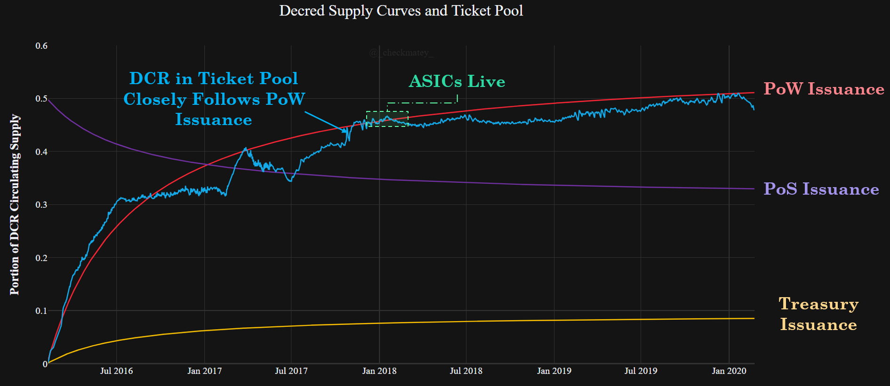
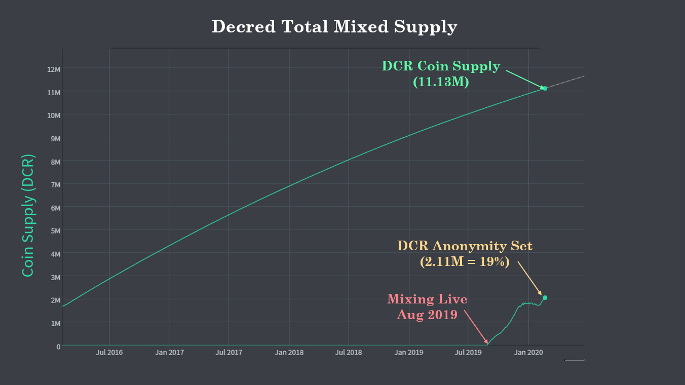
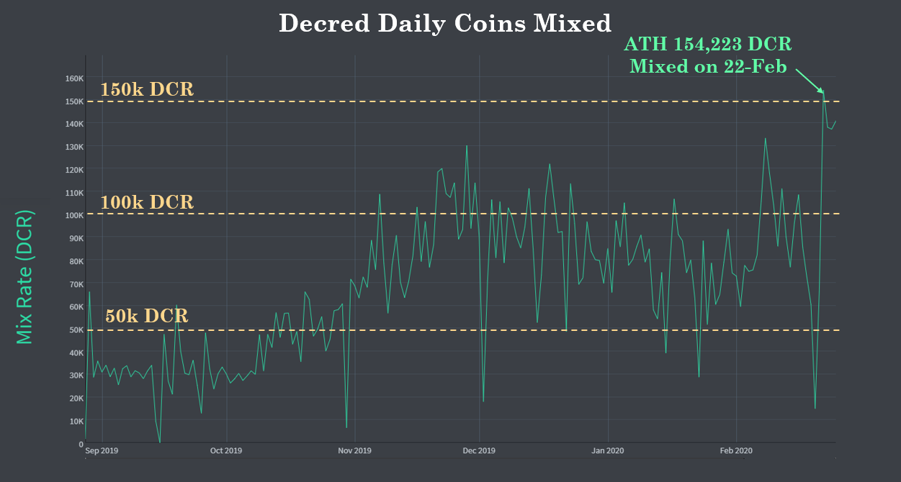
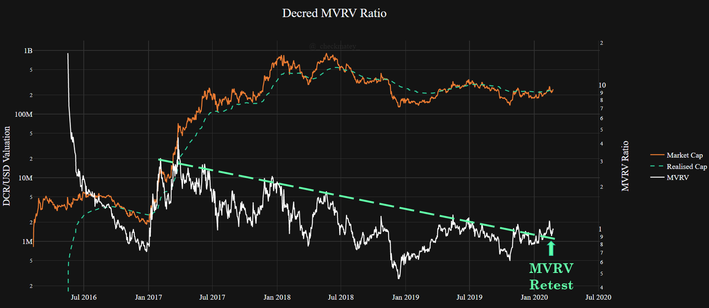

# Our Network - Week 3
https://ournetwork.substack.com/p/our-network-issue-10

## Insight 1 - Tickets and PoW Issuance
Decred has three issuance paths for new coins, 60% are mined via PoW, 30% are staked by PoS and 10% allocated to the Decred Treasury. The chart below shows these issuance curves alongside the total DCR bound in tickets (Y-axis is proportion of circulating supply).

It shows a very distinct relationship between DCR in tickets (blue) and PoW issuance (red). This suggests that a majority of coins distributed by miners have been purchased by market participants and make their way off exchanges and into staking. This trend has persisted both before and after ASIC miners launched on the network and is one indicator that DCR has a reasonable and fair vote decentralisation.

## Insight 2 - Privacy Update
The Decred privacy implementation has been live since late August 2019 and has been met with strong reception and usage. The system facilitates coin-join mixing using the CoinShuffle++ protocol, combined with the constant flow of DCR in the PoS ticket pool.

The supply of mixed DCR has resumed its uptrend after rolling out further stability upgrades for the mixing server allowing wider participation. The anonymity set is now over 19% of all circulating Decred UTXOs (2,113,530 DCR). Note, this counts all mixed UTXOs (incl. tickets) which have not been spent since the mix.

## Insight 3 - Privacy Mixer Volume
Current volumes passing through Decred coin-joins are consistently between 50,000 and 100,000 DCR per day. At recent prices of $20, the protocol is mixing between $1 to $2 Million in value per day. On the 22-Feb, a new all time high was hit with 154,223 DCR in mixed volume, equivalent to over $3 Million.

The fee for mixing is just a standard blockchain transaction fee for users, meaning each [mix can completed for a few cents](https://explorer.dcrdata.org/tx/6d155cb869b40031ce6c2ccda13558d01d8732c3222cf7b888a3251efab9a5ef). 

## Insight 4 - The MVRV Ratio
The Decred MVRV Ratio shows the relationship between the Market Cap and the Realised Cap. Since DCR is always moving on-chain in tickets, the Realised Cap tends to act as support in Bullish markets and resistance in Bear markets.

The DCR Market Cap has recently broken above the Realised Cap and the MVRV Ratio is retesting support on the trend-line which has contained it since mid 2017. The author expects the MVRV to act as an oscillator in response to Bull/Bear cycles.

## Insight 5 - Throughput Thermometer
The Throughput Thermometer compares on-chain throughput between two assets and adjusts for outstanding supply in order to ensure an apples-to-apples comparison is made. This tool is best used to gauge macro bullishness or bearishness.

When the thermometer is trending upwards, Decred on-chain flows are increasing versus Bitcoin flows pound-for-pound, which generally is paired with an uptrend DCR/BTC price (and vice-versa).

The chart below shows that over the past 142 days, Decred has settled 20% more native units on-chain relative to Bitcoin when adjusted for supply - an all time high for the Decred network. Note this is influenced by both increased DCR flows and reduced BTC flows.

## NOT USED
Decred has just completed the v7 consensus change vote which has passed with 99.94% approval. This consensus change upgrades the Decred block headers to enhance SPV wallet security, and optimise the process for PoW miners to include PoS votes. This will lead to fewer missed tickets due to network latency and provide both stakers and miners with more reliable block reward income.

An interesting trend has developed around all consensus change votes so far whereby stake participation rate increases during the vote, and cools-off following it. After the v7 consensus vote completed, the stake participation rate dipped from 52% to 48% of circulating DCR, before bouncing back to XX%. **EDIT ON THURS**

